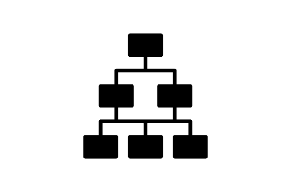

# ARDONCAP

Projeto Final 2025 do Curso Técnico Integrado de Desenvolvimento de Sistemas - Colégio Pedro II - Campus Duque de Caxias

**Integrantes:**
 - Artur Assis Mendonça
 - Caio Henrique Leôncio Firmino
 - João Pedro Domingos Guimarães
 - Pedro Henrique Lyra Gomes da Silva

 ## Tecnologias

Este projeto é desenvolvido utilizando  para desenvolvimento da API de backend, SvelteKit como framework frontend e Tailwind como framework CSS.

Em termos de arquitetura de software, este projeto é composto por duas aplicações:
- API/Backend desenvolvida em Node.js com Express
- Aplicação Frontend desenvolvida com Svelte e estilizada com Tailwind

A Aplicação frontend realiza requisições à API utilizando os verbos HTTP, que por sua vez retorna as informações a serem tratadas pela interface. Todo envio e rebimento de informações entre as duas aplicações é realizada utilizando o formato JSON.

Para detalhes técnicos de como executar o projeto consulte o [README da API](src/api/README.md) e [README da Aplicação Frontend](src/frontend-app/README.md). 

## Descrição do Projeto

O ArdonCap é uma loja virtual voltada ao público que se interessa por moda e cultura, reunindo produtos como acessórios, roupas, itens colecionáveis, discos, instrumentos musicais e mais. A proposta da plataforma é oferecer um ambiente acessível, prático e diversificado, conectando diferentes vendedores e clientes de forma prática na plataforma.

O objetivo é facilitar tanto a atuação dos vendedores, quanto a experiência dos consumidores, promovendo um comércio mais justo e transparente. Dessa forma, o nosso projeto se posiciona contra a exploração de trabalhadores, apoiando práticas mais equilibradas e sustentáveis no comércio.

## Documentação

- [Manual do Usuário](doc/manual.md)
- [Requisitos](doc/requisitos.md)
- [Casos de Uso](doc/CasosDeUso/CasosDeUso.md)
- [Apresentação](doc/apresentacao.pdf)

**Modelagem do Banco de Dados**

